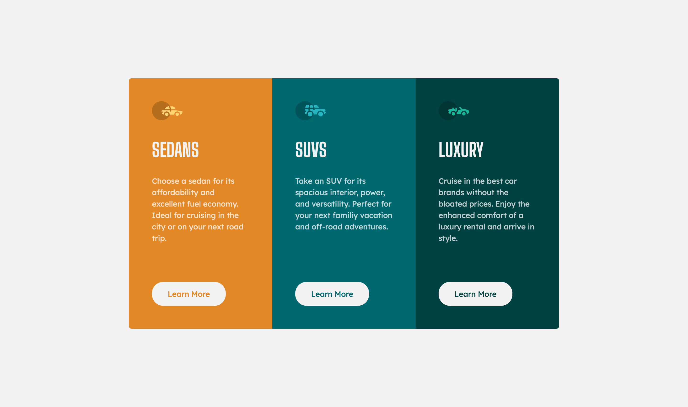

# Frontend Mentor - 3-column preview card component solution

This is a solution to the [3-column preview card component challenge on Frontend Mentor](https://www.frontendmentor.io/challenges/3column-preview-card-component-pH92eAR2-). Frontend Mentor challenges help you improve your coding skills by building realistic projects. 

## Table of contents

- [Overview](#overview)
  - [The challenge](#the-challenge)
  - [Screenshot](#screenshot)
  - [Links](#links)
- [My process](#my-process)
  - [Built with](#built-with)
  - [What I learned](#what-i-learned)
- [Author](#author)

## Overview

### The challenge

Users should be able to:

- View the optimal layout depending on their device's screen size
- See hover states for interactive elements

### Screenshot

### Links

- [Solution URL](https://github.com/dgatialy/fem-3-column-preview-card-component)
- [Live Site](https://peaceful-hamilton-22e69e.netlify.app/)

## My process

### Built with

- Semantic HTML5 markup
- Fluid space & typography
- SASS and CSS custom properties
- Flexbox
- Figma first workflow

### What I learned

- Container queries for 'Fluid Space & Typography' would be helpful.
- Transparent border to show a visible boarder on hover that does not make the layout jump.

#### Fimga
- Starting in Figma is helpful. If you think in components, you take some work out of the front-end. Auto-Layout (aka Flexbox) makes the whole thing simple and clean.
- The inspect mode in Figma makes hand-off easy and seamless.
- Frames as spacers in combination with Auto-Layout: but these could also be their own components (spacer hierarchy). 

## Author

- Frontend Mentor - [@dgatialy](https://www.frontendmentor.io/profile/dgatialy)
